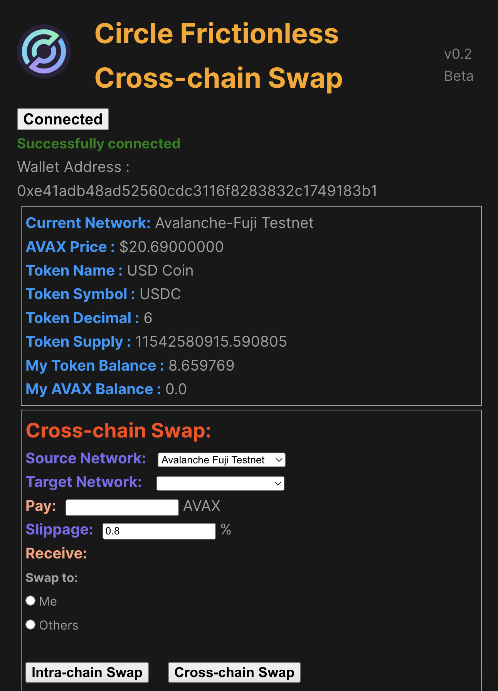

# Circle Frictionless Cross-chain Swap（Circle Swap）

本产品基于 **Cross-chain Transfer Protocol**(CCTP) ，实现原生代币/代币的跨链兑换，并解决跨链兑换中的潜在问题和“摩擦（friction）”，以此降低使用门槛，寻求更广泛的用户类别和并适应更庞大的市场。

## 第 1 部分：产品特性（Product Features）

### 1. 多链资产聚合：

原生代币和 USDC 资产情况在线实时显示，支持多个区块链网络，方便用户实时查看资产情况。

### 2. 无缝跨链传输：

本产品的核心功能，使用 **CCTP** 的“**burn & mint**” 的方式，以 USDC 作为媒介货币进行跨链，用户可以使用原链上的原生代币 或 USDC 直接兑换为目标链上的 USDC。用户指定点击 **Cross-chain Swap** 按钮，全程仅需与 Metamask 钱包交互，不间断地实现资产的跨链兑换。

**视频演示**：

为指定地址做跨链转账（接收者付不起 gas 的情况）：

- [YouTube](https://www.youtube.com/watch?v=SwxfBVx_9w4&t=1s)
- [Bilibili](https://www.bilibili.com/video/BV1mw4m1Z7kb/?spm_id_from=333.999.0.0&vd_source=a9174982a74675c861afd9a4ac2b7d5b)

为自己做跨链转账

- [YouTube](https://www.youtube.com/watch?v=r_VP4SWnbnU)
- [Bilibili](https://www.bilibili.com/video/BV1Vj421f7KR/?vd_source=a9174982a74675c861afd9a4ac2b7d5b)

### 3. 更友好的用户体验：

- 跨链接收者无需担心因原生代币余额不足而导致的接收失败的问题，始终保持跨链可用性。

  当接收者在目标链的余额不足以支付一笔接收 USDC 的交易，则会出现交易失败，导致用户的资金不能够提出，这对于不懂代码的普通用户是非常糟糕的体验。为了解决这个问题，在用户资金不足的情况下，使用开源合约为用户代收 USDC 并发送给最终的接收者。

- 交易后账户信息实时更新，通过页面提供的区块浏览器URL查看交易信息。

 

### 4. 多样的网络支持

- **Mainnet**:
  - Ethereum Mainnet
  - Avalanche C-Chain
  - Optimism Mainnet
  - Arbitrum One
  - Base

- **Testnet**: 
  - Ethereum Goerli
  - Avalanche Fuji
  - Optimism Goerli
  - Arbitrum Goerli
  - Base Goerli

### 5. 更安全的私钥管理

在原生 CCTP 脚本内，需要用户写入索取发送者与接收者的私钥。而本产品考虑私钥安全性，通过 Metamask 钱包的 wallet 对象管理账户私钥，该对象由 Metamask 钱包掌握，降低私钥暴露的可能性，更安全。

### 6. 多端支持

项目同时支持手机移动端以及网页端操作，实现跨链交易更加方便。

## 第 2 部分：产品设计（Product Design）

### 1. 跨链的流程

（待补充……）

### 2. 跨链设计

由于区块链网络之间的不可通信机制，通常需要使用一个 EOA 在目标链上发起一笔交易来接收新 mint 出来的代币。为了在接收 USDC 这一环节尽量做到免信任，本产品在用户指定接收者的时候作出以下判断：

- 当接收者为自己且目标链原生代币足够支付 gas，则此产品直接请求用户切换到网络并引导进行取款操作。由于在目标链发起交易的 EOA 是用户自己，因此用户无需担心跨链的中心化问题。

- 当接收者为他人时，由于对方的私钥不可获得，因此无法像处理自己的钱包地址一样直接通过 Metamask 交互来实现跨链兑换。此产品通过调用合约为用户代收资金并转移给最终的用户。由于合约代码已开源，可以降低跨链的中心化程度。

- 当接收者为自己且目标链原生代币不足以支付gas时，同上。

### 3. 开发进程

目前的核心功能已完成。

后续展望：

- 增强产品的健壮性与高并发性。

- 完善用户界面与交互体验。

- 完成开发者文档。

- 对 swap in/out 增加对多个币种的支持。

## 第 3 部分：价值与商业化（value & commercialization）

1. USDC 作为依附于 Circle 强大的信用背书的稳定币产品，将现实世界的价值输送到 web3 世界。 USDC 作为 CCTP 跨链的媒介，将区块链之间的价值连通起来。

2. 本产品将以 USDC 作为“基础代币”向外延伸出原生代币之间的交换以及其他代币之间的交换，不仅增加了跨链灵活性，也增大了 USDC 的流通量，增强用户粘性。

3. 本产品降低了用户对跨链的使用门槛，优化跨链的交互流程，增强易用性，是一款旨在面向普通用户的通用型产品，也是面向开发者的区块链基础设施。

4. 交易失败概率及交易集中化程度降低，无需 USDC 外的币种储备及价值管理。

5. 通过 USDC 跨链，避免了币种跨链交易的价值波动以及恶意攻击风险。前端服务费用可以相比 Uniswap 等 DEX 更低。

6. 交易量较大的主链上，可以提供同链上 USDC 兑换非 USDC 主流币种的增值服务，收取汇兑差值以及服务费。