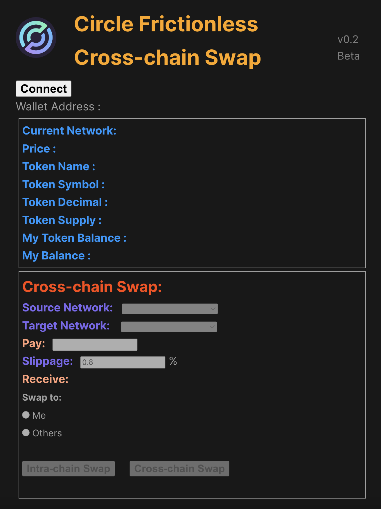

# 前端进程运行

### 1. 安装依赖项

```shell
npm install
```


### 2. 环境文件配置

在工程目录内的[./src/components/.env](./src/components/.env)中配置好各个区块链网络的 RPC URL 和 区块浏览器 API KEY。


### 3. 运行前端进程

```sh
npm run dev
```


### 4. 浏览器页面打开

本地 URL http://127.0.0.1:5173/

显示如下的初始化界面。


